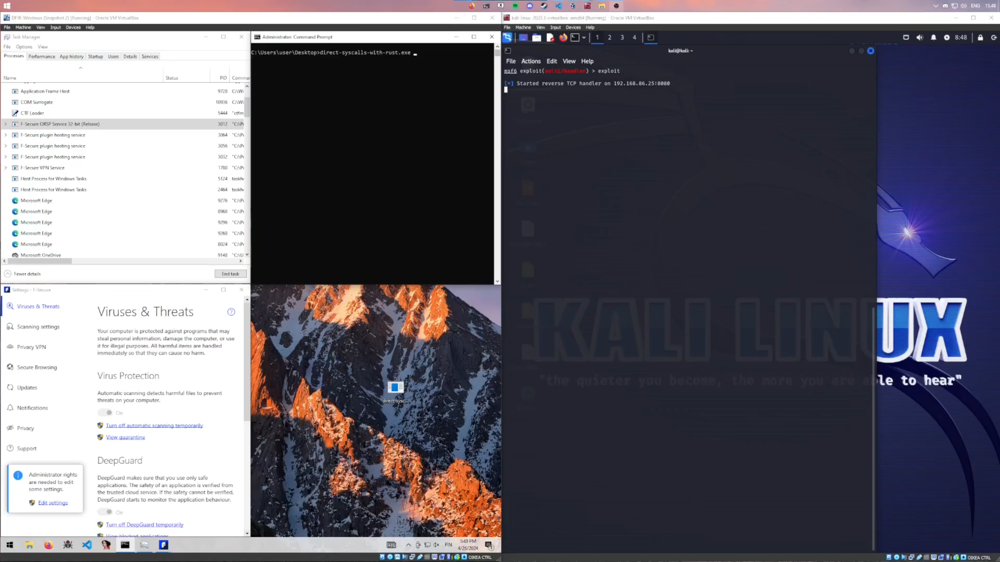

# Utilizing direct syscalls with Rust to avoid hooks
This repo is a proof concept of utilizing direct syscalls with Rust to avoid ntdll hooks placed by EDRs / Antiviruses.

At the time of writing, this can use known bad shellcode (a meterpreter shell), and bypass the majority of big name antimalware solutions. Having a custom reverse shell would make this far better.
 
## Demo

###### *Clicking on the image opens a link to the demo video.*

### The execution flow: 
* The process starts up and begins reconstructing the payload from scraps of encrypted code stored in various sections of the binary.
* After reconstruction, the payload will decrypted and is now ready to be injected.
* The process attempts to open a handle to a specified process.
* If this fails, it attempts to gain SeDebugPrivilege, and tries again.
* After opening a handle, we allocate memory with the protection mask of PAGE_READWRITE. We are using PAGE_READWRITE instead of execute to avoid suspicions.
* The newly allocated memory has the decrypted shellcode data written to it.
* After this, we sleep to further reduce the likelihood of the target process being terminated due to malicous code.
* Now, after sleeping, we change the permissions on the pages to be PAGE_EXECUTE and create a remote thread for our shellcode.

## Usage
Very simple, generate shellcode and pack it to a vector of u8. After this, place it to the DATA type in build.rs, and build. The build.rs encrypts the shellcode with random keys and packs in different sections of the resulting binary.

Using the binary is as simple as running it with the PID of your target process. You can inject to processes that aren't SecureObjects and are owned by your account without admin permissions, but setting SeDebugPrivilege to access SecureObjects does require admin privileges.

## Why this works
This is purely sceptical, but my assumption is that as Rust binaries haven't been around for as long as C/C++ binaries, especially in the malware scene. This results in normal techniques not being fingerprinted.

A process having syscalls should itself already be a huge red flag, but even that flag can be avoided as  as they can just be generated on the fly with WriteProcesMemory or another similar tool.

### Please don't use this for bad stuff, it's just a demo.